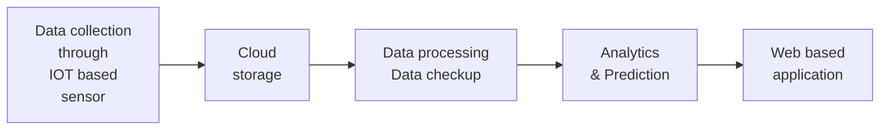
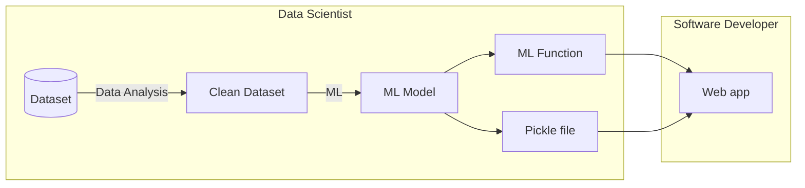
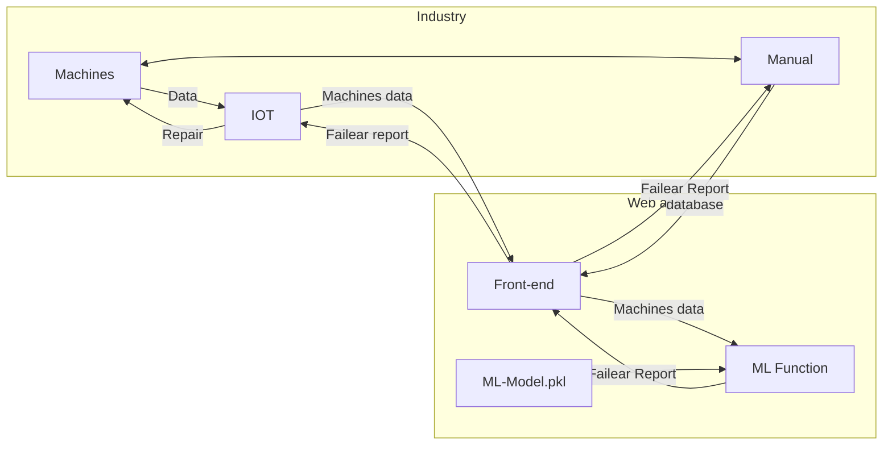

# Smart Industrial Predictive Solutions - [Feynn Labs](https://www.linkedin.com/company/feynn-labs/?originalSubdomain=in) [Internship](https://feynnlabs.com/internships/) 3<sup>rd</sup> project


## Introduction
This is Feynn Labs Internship's 3<sup>rd</sup> project. Here, we have to choose one best project of all our 1<sup>st</sup> projects.

Then need to do:
- Data collection
- Data analysis
- Machine learning
- Creating business model
- Creating finantial equation with the help of data analysis and machine learning. 
- If possible, we have to create app.

> We selected [**Machine Predictive Maintenance for Industrial Machines**](https://github.com/Adhiban1/Machine-Predictive-Maintenance) project

> Web App: [Link1](https://predictive-maintenance-tjaq.onrender.com/) (render.com) and [Link2](https://predictive-maintainances.uc.r.appspot.com/) (GCP)

## About

**Smart Industrial Predictive Solutions** is a forward-looking project with a big goal: to make industries smarter and more efficient. It does this by using fancy technology like data analysis and machine learning to predict when machines might break down. Imagine having a crystal ball that tells you when your car is going to have engine trouble before it even happens. That's what this project aims to do for factories and big machines in industries. By doing this, it helps companies save money, work more safely, and keep everything running smoothly. It's like having a super-smart maintenance team that never misses a beat!

## Docker

[](https://hub.docker.com/r/adhiban/smart-industrial-predictive-solutions)

## Team members
|Name|GitHub link|
|--|--|
|Adhiban Siddarth   | [](https://github.com/Adhiban1/Smart-Industrial-Predictive-Solutions) |
|Karakavalasa venkata pranay | [](https://github.com/Venkatapranay) |
|Malay Vyas | [](https://github.com/MalayVyas/Maintenance-Prediction) |
|Shreyash Banduji Chacharkar | [](https://github.com/ShreyashChacharkar/Predictive-maintainances) |
|Yash Mayur | [](https://github.com/ysmayur1992/predictive_maintenance) |

## Workflow
- Getting details of 1<sup>st</sup> project of each member
- Selecting one project from our 1<sup>st</sup> project
- Or selecting new best project topic other than our projects
- Role selection (Business Specialists, Data Scientists and Software Developer)
- Building business model, creating financial equation, collecting data, doing data analysis & Machine Learning
- Developing web or desktop or mobile app (optional)

## Team members' 1<sup>st</sup> projects

|Name|Project Title|Link|
|--|--|--|
|Adhiban Siddarth|Machine Predictive Maintenance for Industrial Machines|[Github Link](https://github.com/Adhiban1/Machine-Predictive-Maintenance)|
Karakavalasa venkata pranay |Personal Medical Assistant|[PDF Link](pdfs/karakavalasa_venkata_pranay1-Personal_Medical_Assistant.pdf)|
Malay Vyas |University Chances Predictor|[PDF Link](pdfs/Malay-University_Chances_Predictor_App_Report.pdf)|
Shreyash Banduji Chacharkar |Clothing Recommendation System Based on Body Data|[PDF Link](pdfs/Shreyash-Clothing_recommendation_system_based_on_body_data.pdf)|
Yash Mayur |College Recommender|[GitHub Link](https://github.com/ysmayur1992/College_Recommender)|

## Project Evaluation Matrix for Feasibility, Viability, and Monetization

- **Feasibility:** Product/Service can be developed in short term future. (2-3 years)
- **Viability:** Product/Service should be relevant or able to survive in long term future. (20-30 years)
- **Monetization:** Product/Service should be monetizable directly. (indirectly monetizable Product/Service should be dropped for this Project)

> [Project-Assessment.md](Project-Assessment.md)

| Project Title                              | Feasibility (2-3 years) | Viability (20-30 years) | Monetization                   |
|--------------------------------------------|-------------------------|--------------------------|--------------------------------|
| Machine Predictive Maintenance for Industrial Machines | Feasible                | Viable                   | Direct monetization through maintenance services |
| Personal Medical Assistant                   | Less feasible           | Potential viability      | May require complex monetization strategies |
| University Chances Predictor                | Feasible                | Viable                   | Subscription services or partnerships |
| Clothing Recommendation System Based on Body Data  | Feasible                | Viable                   | Monetization through affiliate marketing or personalized shopping experiences |
| College Recommender                         | Feasible                | Viable                   | Subscription services or partnerships |

> Among these, we selected **Machine Predictive Maintenance for Industrial Machines** and we renamed it as **Smart Industrial Predictive Solutions** for our 3<sup>rd</sup> project.

## [Roles](roles.md)
|Role|Person(s)|
|--|--|
|Business Specialists (2) | Karakavalasa venkata pranay & Shreyash Banduji Chacharkar|
|Data Scientists (2)|Malay Vyas & Yash Mayur|
|Software Developer (1)|Adhiban Siddarth|

## Business Model
Real time Web Based monitoring and predictive maintenances app:

*prototype of real time web based predictive maintenance services*



> [Business Model](documents/business_model2.pdf) is prepared by Karakavalasa venkata pranay and Shreyash Banduji Chacharkar

## ML Model ➡️ Web app

Yash Mayur's Machine Learning Model - [Github repo](https://github.com/ysmayur1992/predictive_maintenance)

Malay Vyas's Machine Learning Model - [Github repo](https://github.com/MalayVyas/Maintenance-Prediction)



`ML Function` gets csv file of machines' data and returns failear dataframe of all machines.

```python
def ml_function(csv_path, model_path):
    # loading pre-trained model from model_path
    # pandas dataframe(df) from csv_path
    # df cleaning & preprocessing...
    ...
    ...
    # failear_df prediction from df using the ML model
    return failear_df
```

## Web app architecture



## Upload csv format

|Type|Air temperature [K]|Process temperature [K]|Rotational speed [rpm]|Torque [Nm]|Tool wear [min]|Power|
|--|--|--|--|--|--|--|
L|276|316|1244|15|192|29575|
H|333|302|1925|77|32|12799|
M|286|311|2678|80|50|15481|
|...|...|...|...|...|...|...|
H|338|301|2214|34|245|90977|

You can include extra columns for machine names or number but the above columns in the table must be there in your upload csv.

The report csv file has only failear machines data, for easily getting which machine is failear, another column called index is added in report csv.

## Web App Deployment

We deployed web app in GCP and render.com. Shreyash Banduji Chacharkar deployed web app in GCP [Github repo](https://github.com/ShreyashChacharkar/Predictive-maintainances). I deployed web app in render.com using [docker image](https://hub.docker.com/r/adhiban/smart-industrial-predictive-solutions) - `adhiban/smart-industrial-predictive-solutions:alpha`

> Web App: [Link1](https://predictive-maintenance-tjaq.onrender.com/) (render.com) and [Link2](https://predictive-maintainances.uc.r.appspot.com/) (GCP)

## Project video

[flask-app.mp4](flask-app.mp4)

<video controls autoplay>
    <source src='flask-app.mp4' alt='flask-app.mp4' type='video/mp4'>
</video>

## Gratitude for Exceptional Teamwork: A Journey with My Team

I wanted to express my heartfelt appreciation for the incredible support and expertise my team members have provided throughout this project. My team members' skills in data analysis and machine learning are truly exceptional, and I've had the opportunity to learn a tremendous amount from each member. This project has undoubtedly been the highlight of my team experiences, and I consider myself fortunate to have had the privilege of working with such an outstanding group. Although I've led teams for college projects in my native language, Tamil, I initially had some reservations about leading a team in English. However, working with my team members has been an absolute pleasure. My team members' effective communication and seamless collaboration have made this journey a joy, and I am genuinely grateful to have my team members as my partners in this endeavor. Thank you all so much for your hard work and dedication!